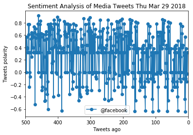

# PlotBot analyze

This tweeter bot will listen for a mention to analyze it's message. The sentiment of the last 500 tweets will be plotted and attached to the reply of the mention.

The bot runs for approx 5 mins.

The mentions are triggered by the call to the user @vero_guirlyn with message "PlotBot analyze"


```python
#!/usr/bin/env python3
# -*- coding: utf-8 -*-
"""
Created on Fri Mar 23 16:49:13 2018

@author: guirlynolivar
"""

#The bot receives tweets via mentions 
#and in turn performs sentiment analysis on 
#the most recent twitter account specified in the mention
#example: @vero_guirlyn PlotBot analyze @cnn

# Dependencies
import tweepy
import config
import pandas as pd
import matplotlib.pyplot as plt
import time
from datetime import datetime

# Setup Tweepy API Authentication
auth = tweepy.OAuthHandler(config.consumer_key, config.consumer_secret)
auth.set_access_token(config.access_token, config.access_token_secret)
api = tweepy.API(auth, parser=tweepy.parsers.JSONParser())

# Setup Vader Sentiment Analyzer
from vaderSentiment.vaderSentiment import SentimentIntensityAnalyzer
analyzer = SentimentIntensityAnalyzer()

today = datetime.now()

def human(tweeter_user):
    """ human
      apply regular known filters to the tweet to determine if the tweet
      came from a bot or a human. 
      Return True if it passes the filter assuming a real human sent the tweet
      False otherwise
    """
#    # "Real Person" Filters
    min_tweets = 5
    max_tweets = 10000
    max_followers = 2500
    max_following = 2500
    lang = "en"
    if (tweeter_user["followers_count"] < max_followers and
        tweeter_user["statuses_count"] > min_tweets and
        tweeter_user["statuses_count"] < max_tweets and
        tweeter_user["friends_count"] < max_following and
        tweeter_user["lang"] == lang):
        return True
    else:
       return False

 
def trigger(tweet):
    """ trigger
    decode the tweet to find the trigger text: PlotBot analyze
    call analyze if the is a mention
    """
    import re
    test_string = tweet.lower()
    pattern = r'(@[a-z]*[A-Z]*)'
    mentions = re.findall(pattern, test_string)
    print(f"Trigger sentiment analysis on {mentions}")
    for u in mentions:
        if u != "@vero":
            print(f'analyze({u})')
            analyze(u)
    return(u)
            
def listen(mention,oldest_tweet):
    """ listen
    performs a search for a tweet with the mention of the bot handle
    """
    tweet_seen = []
    if oldest_tweet == '':
        start_tweet = 0
    else:
        start_tweet = oldest_tweet
        
    public_tweets = api.search(
            mention,
            count=20,
            result_type="recent",
            max_id='')
  
    for tweet in public_tweets["statuses"]:
        tweetid = tweet['id']
        message = tweet['text']
        tweet_seen.append(tweetid)
        print(f"tweet is {tweet['text']}")
        if tweetid > start_tweet and human(tweet['user']):
            user = tweet['user']
            if trigger(message):
                print(f"doing plotting")
                if plotit():
                    reply(user['screen_name'],tweetid)
    
    return(max(tweet_seen))
    
def analyze(target_user):
    """ analyze
    given a user handle user, retrieve their latest 500 tweets and analyze
    using vader sentiment the different tweets. Dump to a csv
    """    
    sentiments =[]
    counter = 0
    for x in range(5): 
        public_tweets = api.user_timeline(target_user, count=100, page=x)
        for tweet in public_tweets:
            tweeter_text = tweet['text']
            vscores = analyzer.polarity_scores(tweeter_text)
            sentiments.append({'user':target_user,
                               'tn':counter,
                               'date':tweet['created_at'],
                               'compound':vscores['compound'],
                               'positive':vscores['pos'],
                               'negative':vscores['neg'],
                               'neutral':vscores['neu'],
                               'tweet':tweeter_text})
            counter+=1
        print(f"Collecting tweets page {x}...")
        time.sleep(10)
        
    # Aggregate into a dataframe the data collected
    sentiment_df = pd.DataFrame(sentiments) 
    sentiment_df.to_csv("media_sentiment_tweeter.csv")
    print(f"Dumped {counter} tweets to the CSV file")

    
def plotit():
    """ ploptit
    creates a plot of the values given
    """   
    try:
        with open("media_sentiment_tweeter.csv") as twfile:
            twanalysis = pd.read_csv(twfile, delimiter=',')
            mention = twanalysis['user'].unique()
            twanalysis.plot(x="tn", y="compound", marker='o',label=mention[0])
            
            # Incorporate the other graph properties
            title = "Sentiment Analysis of Media Tweets " + today.strftime("%a %b %d %Y")
            plt.title(title)
            plt.ylabel("Tweets polarity")
            plt.xlabel("Tweets ago")
            plt.xlim(500,0) # inverse the x- axis to show decrease over time
            # Save the figure1
            plt.savefig("sentiment_analysis_plotted.png")
            plt.legend(loc='best')
            plt.show()
            return True
    except:
        print("error with twitter data retrieval from csv")
        return False
        
def reply(tweet_author, tweet_id):
    """ reply
    reply to the tweet that triggered the request with the generated plot of the 
    sentiment analysis
    """
    try:
        api.update_with_media("sentiment_analysis_plotted.png", 
                              status="sentimenmt analysis request from @"+tweet_author, 
                              in_reply_to_status_id=tweet_id)
        print(f"replied to {tweet_author}")
    except Exception:            
        print(f"something went wrong with the reply to {tweet_author}")
    
"""

"""
max_time = 300 #run for five minutes
start_time = time.time()  # remember when we started
tw_id=''
while (time.time() - start_time) < max_time:
    tw_id=listen('@vero_guirlyn Plotbot analyze',tw_id)   
    time.sleep(120)
    
print(f"Waited around for {max_time} seconds plotbot mention, done now")    
  

```

    tweet is @vero_guirlyn Plotbot analyze @CBCNews
    Trigger sentiment analysis on ['@vero', '@cbcnews']
    analyze(@cbcnews)
    Collecting tweets page 0...
    Collecting tweets page 1...
    Collecting tweets page 2...
    Collecting tweets page 3...
    Collecting tweets page 4...
    Dumped 500 tweets to the CSV file
    doing plotting


    replied to vero_guirlyn
    tweet is @vero_guirlyn Plotbot analyze @FoxNews
    Trigger sentiment analysis on ['@vero', '@foxnews']
    analyze(@foxnews)
    Collecting tweets page 0...
    Collecting tweets page 1...
    Collecting tweets page 2...
    Collecting tweets page 3...
    Collecting tweets page 4...
    Dumped 500 tweets to the CSV file
    doing plotting


    replied to vero_guirlyn
    tweet is @vero_guirlyn Plotbot analyze @katyperry
    Trigger sentiment analysis on ['@vero', '@katyperry']
    analyze(@katyperry)
    Collecting tweets page 0...
    Collecting tweets page 1...
    Collecting tweets page 2...
    Collecting tweets page 3...
    Collecting tweets page 4...
    Dumped 500 tweets to the CSV file
    doing plotting


    replied to vero_guirlyn
    tweet is @vero_guirlyn Plotbot analyze @BarackObama
    Trigger sentiment analysis on ['@vero', '@barackobama']
    analyze(@barackobama)
    Collecting tweets page 0...
    Collecting tweets page 1...
    Collecting tweets page 2...
    Collecting tweets page 3...
    Collecting tweets page 4...
    Dumped 500 tweets to the CSV file
    doing plotting


    replied to vero_guirlyn
    tweet is @vero_guirlyn Plotbot analyze @BillGates
    Trigger sentiment analysis on ['@vero', '@billgates']
    analyze(@billgates)
    Collecting tweets page 0...
    Collecting tweets page 1...
    Collecting tweets page 2...
    Collecting tweets page 3...
    Collecting tweets page 4...
    Dumped 500 tweets to the CSV file
    doing plotting
    error with twitter data retrieval from csv
    tweet is @vero_guirlyn Plotbot analyze @google
    Trigger sentiment analysis on ['@vero', '@google']
    analyze(@google)
    Collecting tweets page 0...
    Collecting tweets page 1...
    Collecting tweets page 2...
    Collecting tweets page 3...
    Collecting tweets page 4...
    Dumped 500 tweets to the CSV file
    doing plotting


    replied to vero_guirlyn
    tweet is @vero_guirlyn Plotbot analyze @facebook
    Trigger sentiment analysis on ['@vero', '@facebook']
    analyze(@facebook)
    Collecting tweets page 0...
    Collecting tweets page 1...
    Collecting tweets page 2...
    Collecting tweets page 3...
    Collecting tweets page 4...
    Dumped 500 tweets to the CSV file
    doing plotting





    replied to vero_guirlyn
    tweet is @vero_guirlyn Plotbot analyze @udacity
    Trigger sentiment analysis on ['@vero', '@udacity']
    analyze(@udacity)
    Collecting tweets page 0...
    Collecting tweets page 1...
    Collecting tweets page 2...
    Collecting tweets page 3...
    Collecting tweets page 4...
    Dumped 500 tweets to the CSV file
    doing plotting


    replied to vero_guirlyn
    tweet is @vero_guirlyn Plotbot analyze @nytimes
    Trigger sentiment analysis on ['@vero', '@nytimes']
    analyze(@nytimes)
    Collecting tweets page 0...
    Collecting tweets page 1...
    Collecting tweets page 2...
    Collecting tweets page 3...
    Collecting tweets page 4...
    Dumped 500 tweets to the CSV file
    doing plotting


    replied to vero_guirlyn
    tweet is @vero_guirlyn Plotbot analyze @cnn
    Trigger sentiment analysis on ['@vero', '@cnn']
    analyze(@cnn)
    Collecting tweets page 0...
    Collecting tweets page 1...
    Collecting tweets page 2...
    Collecting tweets page 3...
    Collecting tweets page 4...
    Dumped 500 tweets to the CSV file
    doing plotting


    replied to vero_guirlyn
    Waited around for 300 seconds plotbot mention, done now

